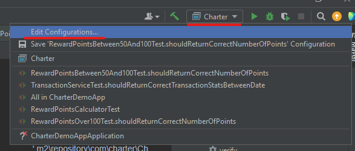
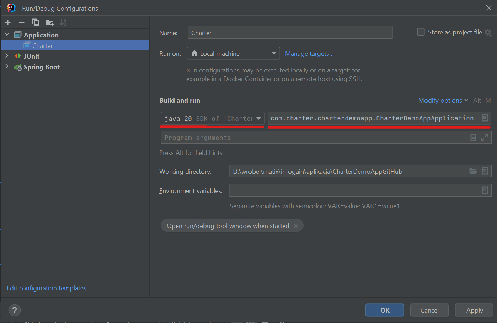

# Info

## Charter Demo Application

This project is demo for coding task

A retailer offers a rewards program to its customers, awarding points based on each recorded purchase.
A customer receives 2 points for every dollar spent over $100 in each transaction, plus 1 point for every dollar spent
over $50 in each transaction (e.g. a $120 purchase = 2x$20 + 1x$50 = 90 points).
Given a record of every transaction

# Getting Started

Download and setup java version 20
[JDK 20](https://jdk.java.net/20/)

## how run manually

* To run project You need [Maven](https://dlcdn.apache.org/maven/maven-3/3.9.1/binaries/apache-maven-3.9.1-bin.zip)
  download and unpack
* Run maven install command in project catalog

```
    mvn clean install
    if you havent maven
    ./mvnw clean install

```

* go to localRepository '.m2\repository\com\charter\CharterDemoApp\0.0.1-SNAPSHOT\' and run:

```
    java -jar CharterDemoApp-0.0.1-SNAPSHOT.jar
    
    or in project directory run
    ./mvnw spring-boot:run
```

application will start

goto the browser and use
link [http://127.0.0.1:8080/swagger-ui/index.html#](http://127.0.0.1:8080/swagger-ui/index.html#)

## how run in IntelliJ

Go to configuration



Create configuration and run application



Run application by play button and it will start

goto the browser and use
link [http://127.0.0.1:8080/swagger-ui/index.html#](http://127.0.0.1:8080/swagger-ui/index.html#)

### Reference Documentation - main libs used in project

* [Official Apache Maven documentation](https://maven.apache.org/guides/index.html)
* [Spring Web](https://docs.spring.io/spring-boot/docs/3.0.0/reference/htmlsingle/#web)
* [Spring Data JPA](https://docs.spring.io/spring-boot/docs/3.0.0/reference/htmlsingle/#data.sql.jpa-and-spring-data)
* [Spring Boot Actuator](https://docs.spring.io/spring-boot/docs/3.0.0/reference/htmlsingle/#actuator)

### Author

krzysztof.wroblewski@infogain.com